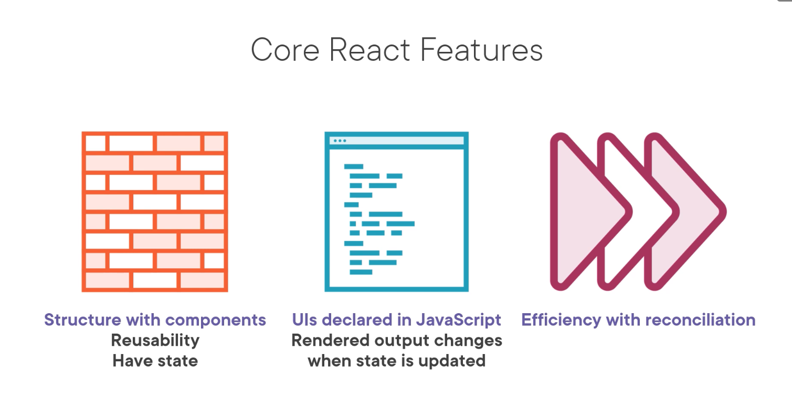

# React18Fundamentals

- https://app.pluralsight.com/course-player?courseId=9a3771fa-626e-4708-8634-c49cc8616922

## What is React

- Javascript library to build UI's
- Develop hierarchies of re-usable components

### Offers

- Reconciliation is like change detection in Angular
  

## Anatomy of a Component

- Components are JS functions that seem like html. They are actually JSX
- JSX converts one syntax to another. JSX => JS
  https://babeljs.io/

- **Seperation of concerns:**

  - react(core lib) vs react-dom (renders components)
  - react-native (for mobile apps), can be used with react (core) alternatively

- build in components for example are "div". We can make our custom component banner

      // Banner using PascalCase
      const Banner = () => (<h1> custom comp</h1>);

- Dom components are camelCased , custom components are PascalCase
- Use function components over other types NBNB

- JSX is instructions on how to render the DOM
- Component composition starts with the root component "app". Then we have children components "Banner" and "Chart"; for example/

### Tools

- We will be using Next.js but this is as close to "pure react" so that we maintain high versatility

### Create a react application

- install node using the package manager

      // create react app
      npx create-next-app globamantics

- Now lets browse the anatomy of the react app

  - package.json contains all the dependencies
  - there are also devDependencies only present at developement time
  - build creates a production build and start runs a production build
  - lint monitors code for erros
  - the public folder is untouched by web-pack
  - web-pack is used by next.js to proccess the files we use in the project, minimising and bundling the efficiently

        // start project
        // https://nextjs.org/telemetry
        npm run dev

  - The pages directory contains the index.js (root component)
  - It is a function that returns JSX
  - there is a watcher to auto update without reloading!!!
  - what does export do? it makes these modules available to other modules
  - these can then be imported in to other modules
  - we have 2 choices for export

        // named export (better for tree shaking)
        export 

        // no specific name export (better for more flexibility)
        export default

- EsLint helps with styling and debugging
            
       npm run lint 

- React Dev Tools Chrome plugin 

    1: profiler, 2: Components hierarchy

## Styling
-   _document.js is considered the "index.html" for nextJS
-   bootstrap positioning system
    -   row