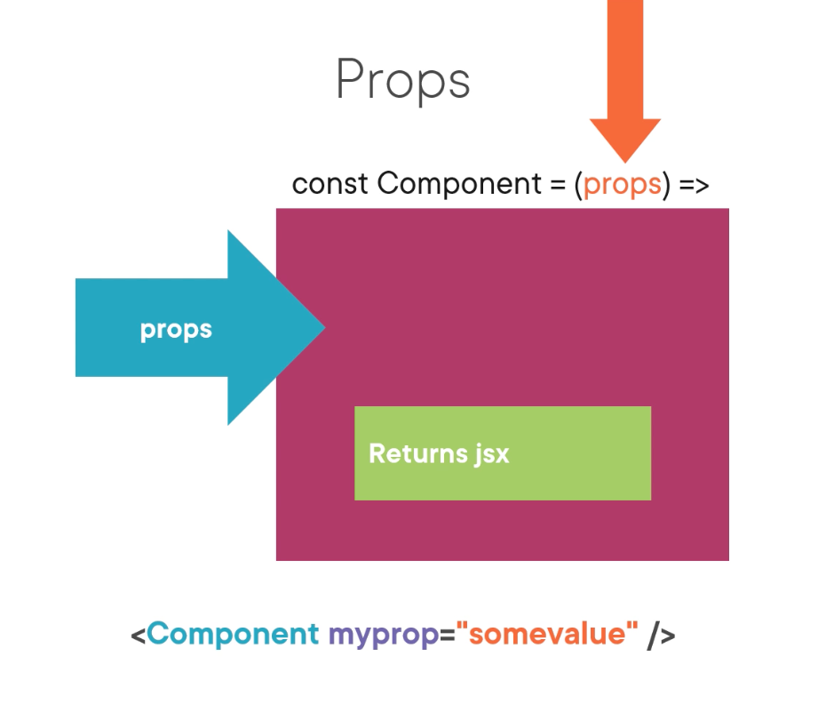
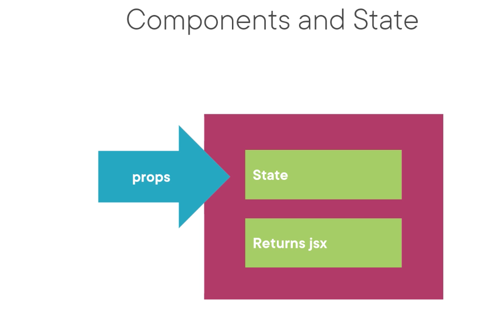
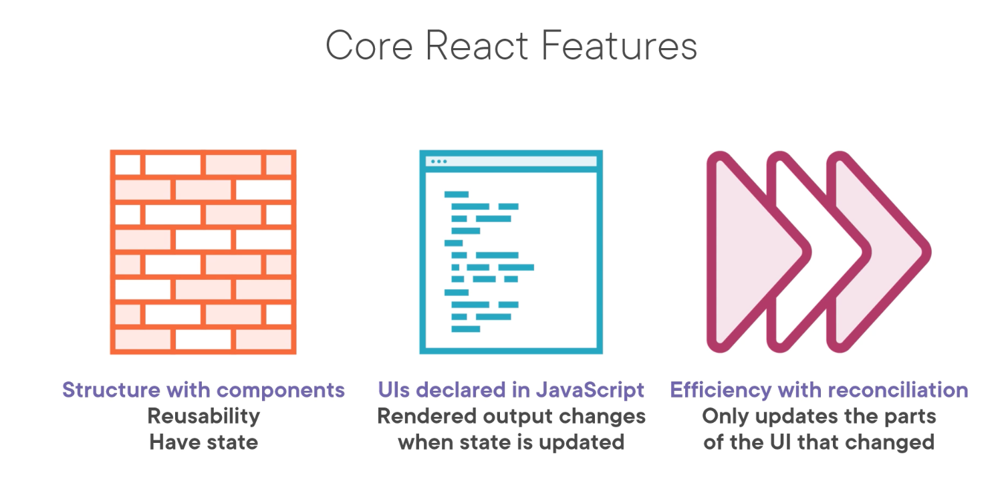

# React18Fundamentals

- https://app.pluralsight.com/course-player?courseId=9a3771fa-626e-4708-8634-c49cc8616922

## What is React

- Javascript library to build UI's
- Develop hierarchies of re-usable components

### Offers

- Reconciliation is like change detection in Angular
  

## Anatomy of a Component

- Components are JS functions that seem like html. They are actually JSX
- JSX converts one syntax to another. JSX => JS
  https://babeljs.io/

- **Seperation of concerns:**

  - react(core lib) vs react-dom (renders components)
  - react-native (for mobile apps), can be used with react (core) alternatively

- build in components for example are "div". We can make our custom component banner

      // Banner using PascalCase
      const Banner = () => (<h1> custom comp</h1>);

- Dom components are camelCased , custom components are PascalCase
- Use function components over other types NBNB

- JSX is instructions on how to render the DOM
- Component composition starts with the root component "app". Then we have children components "Banner" and "Chart"; for example/

### Tools

- We will be using Next.js but this is as close to "pure react" so that we maintain high versatility

### Create a react application

- install node using the package manager

      // create react app
      npx create-next-app globamantics

- Now lets browse the anatomy of the react app

  - package.json contains all the dependencies
  - there are also devDependencies only present at developement time
  - build creates a production build and start runs a production build
  - lint monitors code for erros
  - the public folder is untouched by web-pack
  - web-pack is used by next.js to proccess the files we use in the project, minimising and bundling the efficiently

        // start project
        // https://nextjs.org/telemetry
        npm run dev

  - The pages directory contains the index.js (root component)
  - It is a function that returns JSX
  - there is a watcher to auto update without reloading!!!
  - what does export do? it makes these modules available to other modules
  - these can then be imported in to other modules
  - we have 2 choices for export

        // named export (better for tree shaking)
        export

        // no specific name export (better for more flexibility)
        export default

- EsLint helps with styling and debugging

       npm run lint

- React Dev Tools Chrome plugin

  1: profiler, 2: Components hierarchy

## Styling

- \_document.js is considered the "index.html" for nextJS
- bootstrap positioning system

  - row

- Much like html tags. Componenents also have style attributes

## Hooks, Props and State NBNBNBNB

- So far we used static components, but this will change when we now receive inputs from other components

- Props are readOnly !!!!
- Prop data flow is uni-directional

- Props pass arguments to components
- Props use html like syntax

- Props have children rendered in the dom
- We can pass and use children as a prop

- JSX returned from a component can only have one parent element
- We can make an empty parent element called a "React.Fragment", now we render the child components only, without a parent node

        // with the help of key react knows to only re-render newly inserted elements
        // not re-render each house
        <tr key={house.id}>

- ... (spread operator for house)
- currency formatter helps show pipes use case

- Hooks

  - General

    - a function
    - always has the use prefix
    - Encapsulates complexity

  - Rules of Hooks
    - only be called at the top level
    - hooks need to always be called
    - thus always called in the same order
    - only called in a function component
      (except custom hook)

- We use JSX , not html
- JSX generates HTML
  

- State is internal component data
- Uses the State hook
- Use state takes the init value
- contains current value and function to change state

### Prop changes

- What is a prop for one component is often a "state" for another
- there is a tree of react elements. It will only re-render the new tree elements.
- this is called reconciliation. as we saw prior , the key map helped with this process to not rerender everything.
  

## Component Rendering

- Rendering is the running of the components function
- Reconciliation is the react way of updating the browser after rendering took place
- Rendering is not reconciliation
- Currently every child of the parent (in the tree) gets re-rendered on re-render of the parent
  - Thus we keep children low using pure functions
  - Pure functions always returns the same output for given input
  - Pure functions can be cached
  - A components function should be pure (return the same JSX given input -> output)
- We can avoid this re-render of all children using cache (React.memo)
- 
